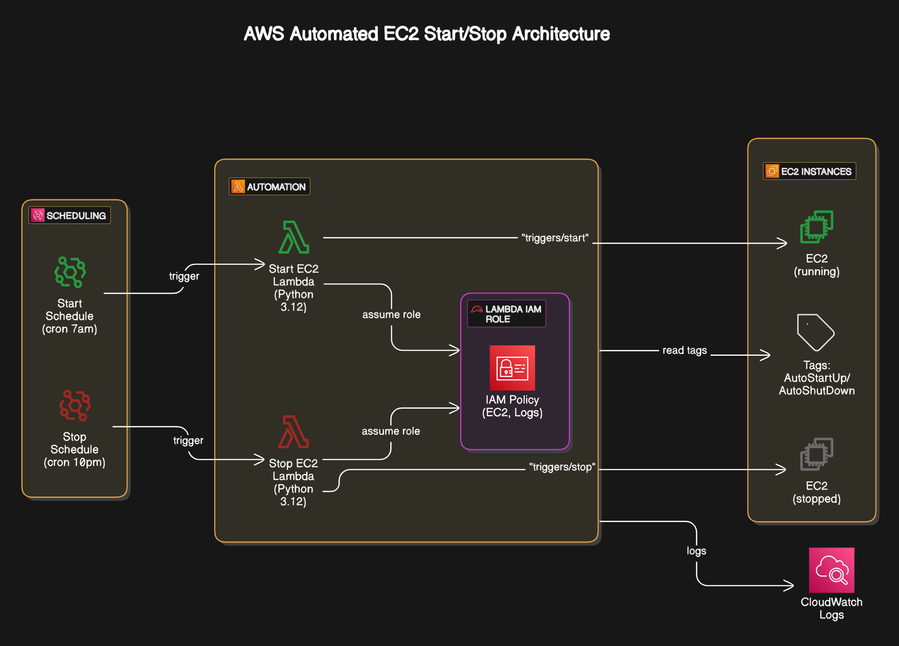

# Automating EC2 Instance Start and Stop

This document outlines the process of automating the starting and stopping of EC2 instances in AWS using AWS Lambda and CloudWatch Events based on tags assigned to the EC2 instances.

## Architecture



**Tags:**
- `AutoShutDown: true`
- `AutoStartUp: true`

*Note: Tags are case-sensitive and space-sensitive.*

## Steps:

### 1. Policy Creation:

- Go to IAM in the AWS Console.
- Create a new policy with the following JSON permissions. This policy grants access to Lambda, EC2 instances, and CloudWatch logs.

```json
{
    "Version": "2012-10-17",
    "Statement": [
        {
            "Sid": "VisualEditor0",
            "Effect": "Allow",
            "Action": [
                "ec2:DescribeInstances",
                "ec2:StartInstances",
                "ec2:DescribeTags",
                "logs:*",
                "ec2:StopInstances",
                "ec2:DescribeInstanceStatus"
            ],
            "Resource": "*"
        }
    ]
}
```

### 2. Attach to a Role:

- Create a new IAM Role.
- Attach the policy created in Step 1 to this role.
- This role will be used by the Lambda functions to interact with EC2 instances.

### 3. Lambda Functions:

Two Lambda functions are required: one for starting instances and one for stopping them.

- **Create Lambda Functions:**
    - In the AWS Lambda console, create two new functions.
    - Choose Python 3.12 as the runtime.
    - For each function, attach the IAM role created in Step 2 by selecting "Use an existing role" under the default execution role settings.

- **Lambda Function Code:**
    - **For Stopping Instances (e.g., name it `stopEC2Instances`):**
        - Use the code from `stop_instance.py`.
        - This function filters instances tagged with `AutoShutDown: true` and are in the "running" state, then stops them.
        - **Remember to replace `<your instance region>` in the code with your actual AWS region (e.g., `us-east-1`).**

    - **For Starting Instances (e.g., name it `startEC2Instances`):**
        - Use the code from `start_instance.py`.
        - This function filters instances tagged with `AutoStartUp: true` and are in the "stopped" state, then starts them.
        - **Remember to replace `<your instance region>` in the code with your actual AWS region (e.g., `us-east-1`).**

- **Lambda Configuration:**
    - For both Lambda functions, navigate to the Configuration settings.
    - Increase the **Timeout** to a sufficient value (e.g., 5 minutes) to ensure the function has enough time to execute, especially if you have many instances.

- **Deploy and Test:**
    - Deploy the changes for both Lambda functions.
    - Test each function to verify that it correctly identifies and processes the tagged instances. Check the CloudWatch logs for output and any errors.

### 4. CloudWatch Schedule (EventBridge Schedules):

Use CloudWatch Events (now part of Amazon EventBridge) to trigger the Lambda functions on a schedule.

- In the AWS CloudWatch console (or Amazon EventBridge console), navigate to **Schedules** (under Events).
- Click **Create schedule**.

- **For the Stop Schedule:**
    - **Name:** Give your schedule a descriptive name (e.g., `StopEC2InstancesDaily`).
    - **Schedule pattern:**
        - Select **Recurring schedule**.
        - Set your desired **Time zone** (e.g., `Asia/Calcutta` for UTC+5:30).
        - Choose **Cron-based schedule**.
        - **Cron expression:** To stop instances Monday to Friday at 10 PM, use `0 22 ? * MON-FRI *`.
    - **Target:**
        - Select **AWS Lambda** as the target API.
        - Choose your `stopEC2Instances` Lambda function.
    - Save the schedule.

- **For the Start Schedule:**
    - Create another schedule.
    - **Name:** Give your schedule a descriptive name (e.g., `StartEC2InstancesDaily`).
    - **Schedule pattern:**
        - Select **Recurring schedule**.
        - Set your desired **Time zone**.
        - Choose **Cron-based schedule**.
        - **Cron expression:** To start instances Monday to Friday at 7 AM, use `0 7 ? * MON-FRI *`.
    - **Target:**
        - Select **AWS Lambda** as the target API.
        - Choose your `startEC2Instances` Lambda function.
    - Save the schedule.

Your EC2 instances tagged with `AutoStartUp: true` and `AutoShutDown: true` will now automatically start and stop based on the defined CloudWatch schedules. Assign the tags to the non-production instances you want to automate. 